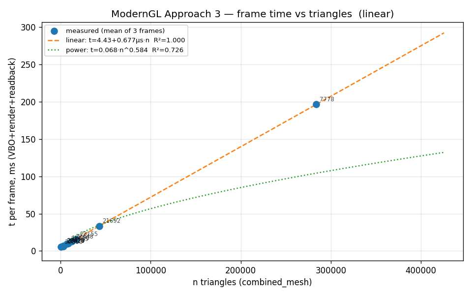
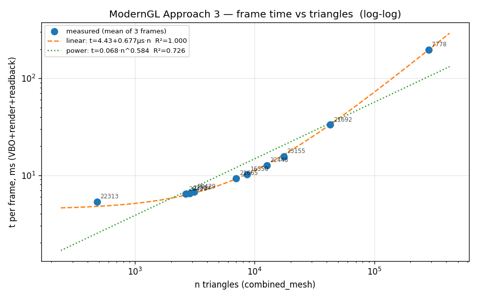
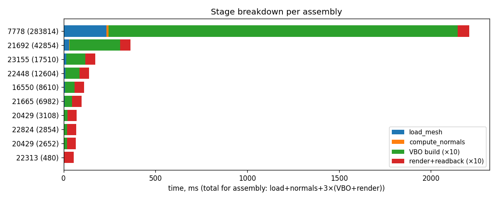
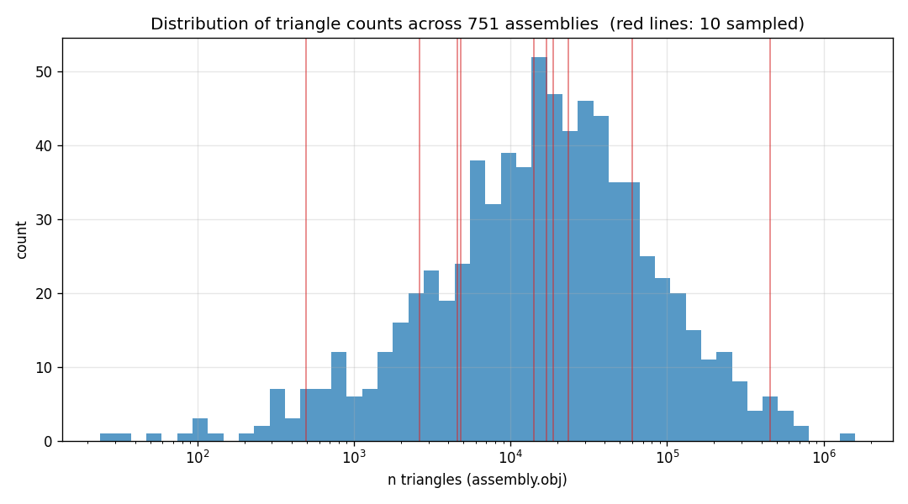
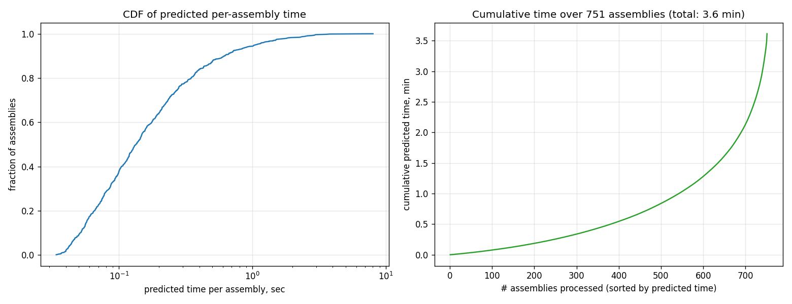

# Benchmark Report — SEG_AIM rendering pipeline (Approach 3 ModernGL)

## Setup

- Host: `Neonilas-MacBook-Air.local`  ·  Platform: `macOS-15.7.4-arm64-arm-64bit-Mach-O`
- Python: `3.14.3`  ·  moderngl: `5.12.0`
- GL: `Apple` / `Apple M4`
- Image size: 512  ·  FOV: 60
- Frames per assembly: 10  ·  Warmup runs: 1
- Timestamp: 2026-05-13 18:15:41

## Per-assembly timings (10 measured)

| assembly | n_tri (combined) | t_load (ms) | t_normals (ms) | t_vbo (ms) | t_render (ms) | t_per_frame (ms) | t_total (s) |
|---|---:|---:|---:|---:|---:|---:|---:|
| `22313_3a8b93dc` | 480 | 1.0 | 0.05 | 0.31 | 5.00 | 5.30 | 0.054 |
| `20429_9dd95c38` | 2,652 | 2.4 | 0.13 | 1.57 | 4.82 | 6.40 | 0.066 |
| `22824_65fa15ec` | 2,854 | 3.0 | 0.11 | 1.67 | 4.84 | 6.51 | 0.068 |
| `20429_419c4cdd` | 3,108 | 2.5 | 0.12 | 1.84 | 4.91 | 6.75 | 0.070 |
| `21665_2e14b6ff` | 6,982 | 5.4 | 0.25 | 4.14 | 5.15 | 9.29 | 0.098 |
| `16550_e88d6986` | 8,610 | 8.2 | 0.29 | 5.10 | 5.10 | 10.20 | 0.110 |
| `22448_1f21757a` | 12,604 | 10.4 | 0.44 | 7.57 | 5.10 | 12.67 | 0.138 |
| `23155_d7305c5f` | 17,510 | 14.8 | 0.68 | 10.24 | 5.36 | 15.60 | 0.172 |
| `21692_777db9e2` | 42,854 | 30.9 | 1.56 | 27.59 | 5.57 | 33.16 | 0.364 |
| `7778_3a9748b3` | 283,814 | 234.2 | 9.32 | 190.18 | 6.35 | 196.53 | 2.209 |

## Regression (per-frame time)

- **Linear**: t = 4.4339 + 0.6765·n µs/triangle  ·  R² = 1.0000  ·  LOOCV-MAE = 0.758 ms
- **Power**: t = 6.793e-05 · n^0.5843  ·  R² = 0.7262  ·  LOOCV-MAE = 17.326 ms
- **Chosen**: `linear` (lowest LOOCV-MAE)

## Prediction for full data/ folder

- 751 assemblies parsed from `data/` (out of 754 total)
- Sum of triangles (assembly.obj): 36,325,317
- `combined_mesh` / `assembly.obj` triangle ratio (median): **k = 0.661**

- **Render-only (naive, assembly.obj n_tri)**: 310.7 s = 5.2 min = 0.09 h
- **Render-only (corrected, n_tri × k)**: 216.8 s = 3.6 min = 0.06 h
- **Render-only bootstrap 95% CI**: [3.3, 3.6] min

## Full pipeline: label_mesh + render

- **t_label_mesh ≈ 5.00 ms + 1.939 µs · n_tri**  (R² = 0.9994, LOOCV-MAE = 16.37 ms)

| stage | total time |
|---|---:|
| label_mesh on 751 assemblies | 74.2 s = 1.2 min |
| render (10 frames/assembly × 751, corrected) | 216.8 s = 3.6 min |
| **FULL pipeline** | **291.0 s = 4.9 min = 0.08 h** |

### Measured `t_label_mesh` (10 sampled)

| assembly | n_tri (assembly.obj) | measured t_label (s) |
|---|---:|---:|
| `16550_e88d6986` | 16,896 | 0.034 |
| `20429_419c4cdd` | 4,792 | 0.010 |
| `20429_9dd95c38` | 4,576 | 0.009 |
| `21665_2e14b6ff` | 14,052 | 0.022 |
| `21692_777db9e2` | 59,806 | 0.132 |
| `22313_3a8b93dc` | 496 | 0.005 |
| `22448_1f21757a` | 18,702 | 0.043 |
| `22824_65fa15ec` | 2,640 | 0.014 |
| `23155_d7305c5f` | 23,554 | 0.060 |
| `7778_3a9748b3` | 457,522 | 0.891 |

## assembly.obj vs combined_mesh.obj (10 sampled)

| assembly | n_tri (assembly.obj) | n_tri (combined) | ratio |
|---|---:|---:|---:|
| `16550_e88d6986` | 16,896 | 8,610 | 0.510 |
| `20429_419c4cdd` | 4,792 | 3,108 | 0.649 |
| `20429_9dd95c38` | 4,576 | 2,652 | 0.580 |
| `21665_2e14b6ff` | 14,052 | 6,982 | 0.497 |
| `21692_777db9e2` | 59,806 | 42,854 | 0.717 |
| `22313_3a8b93dc` | 496 | 480 | 0.968 |
| `22448_1f21757a` | 18,702 | 12,604 | 0.674 |
| `22824_65fa15ec` | 2,640 | 2,854 | 1.081 |
| `23155_d7305c5f` | 23,554 | 17,510 | 0.743 |
| `7778_3a9748b3` | 457,522 | 283,814 | 0.620 |

## Measured vs predicted (10 sampled — sanity check)

| assembly | n_tri (combined) | measured (s) | predicted (s) | rel err |
|---|---:|---:|---:|---:|
| `22313_3a8b93dc` | 480 | 0.054 | 0.044 | 19.4% |
| `20429_9dd95c38` | 2,652 | 0.066 | 0.064 | 4.4% |
| `22824_65fa15ec` | 2,854 | 0.068 | 0.065 | 4.4% |
| `20429_419c4cdd` | 3,108 | 0.070 | 0.067 | 4.1% |
| `21665_2e14b6ff` | 6,982 | 0.098 | 0.098 | 0.1% |
| `16550_e88d6986` | 8,610 | 0.110 | 0.111 | 0.7% |
| `22448_1f21757a` | 12,604 | 0.138 | 0.142 | 3.4% |
| `23155_d7305c5f` | 17,510 | 0.172 | 0.180 | 5.0% |
| `21692_777db9e2` | 42,854 | 0.364 | 0.374 | 2.8% |
| `7778_3a9748b3` | 283,814 | 2.209 | 2.204 | 0.2% |

## Files

- `triangles_assembly_obj.csv` — все ~754 сборок: n_triangles из `assembly.obj`
- `triangles_combined.csv` — 10 выбранных: n_triangles из `combined_mesh.obj`
- `timings_raw.csv` — per-frame timings (30 строк)
- `timings_per_assembly.csv` — агрегаты по сборкам (10 строк)
- `regression.json` — параметры моделей и метаданные
- `prediction_per_assembly.csv` — прогноз для всех 754
- `figures/` — графики и `samples/<id>/frame_NN.png` визуализации

_Average measured total time per sampled assembly: 0.335 s_
